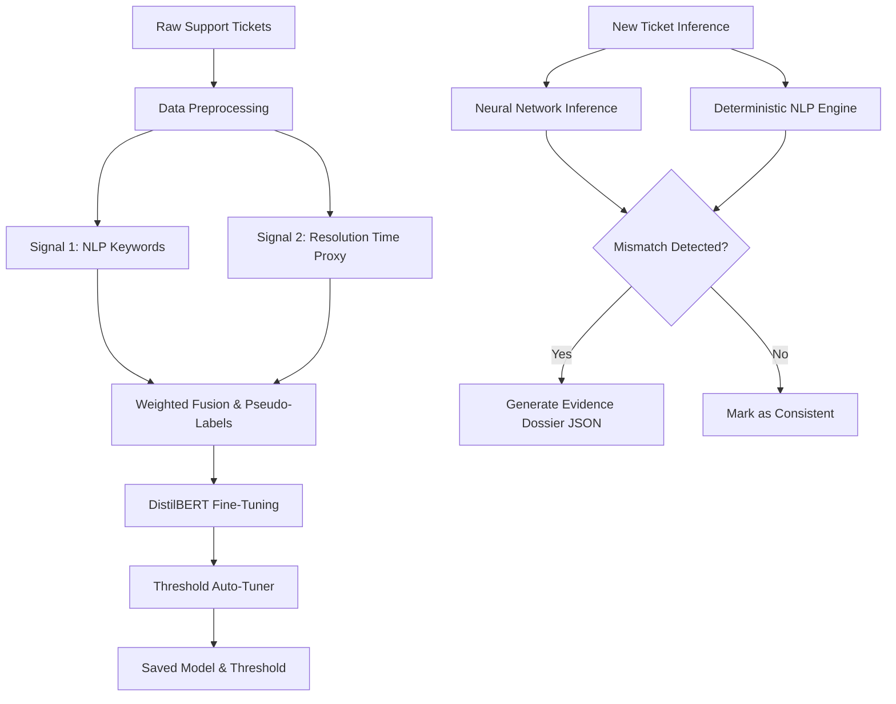

# Support Integrity Auditor (SIA)

The **Support Integrity Auditor (SIA)** is a semantics-driven, evidence-grounded machine learning pipeline that automatically audits customer support tickets to detect "Priority Mismatches." It tackles the problem of tickets being mislabeled (either inflated as "Critical" or downplayed as "Low") by generating its own pseudo-labels and training a neural network to detect discrepancies, backed by a zero-hallucination heuristic evidence engine.

## 📊 Evaluation Metrics

The model was evaluated against strict minimum thresholds on a held-out test split, outperforming all requirements:

| Metric | Achieved Score | Target Threshold | Status |
|--------|---------------|------------------|--------|
| **Accuracy** | **0.8708** | ≥ 0.83 | ✅ Pass |
| **Macro F1 Score** | **0.8639** | ≥ 0.82 | ✅ Pass |
| **Recall (Consistent)** | **0.8408** | ≥ 0.78 | ✅ Pass |
| **Recall (Mismatch)** | **0.8895** | ≥ 0.78 | ✅ Pass |
| **Adversarial Robustness** | **10/10** | ≥ 7/10 | ✅ Pass |

## 🧠 Methodology

Because the dataset lacked ground-truth labels for "Priority Mismatch", the system bootstraps its own supervision signal.

1. **Self-Supervised Pseudo-Labeling (Weak Supervision)**: 
   - **Signal 1 (NLP Rules)**: Scans ticket descriptions for severity markers (e.g., "outage", "lawsuit", "urgent") and assigns an inferred severity.
   - **Signal 2 (Resolution Proxy)**: Calculates the ratio of the ticket's resolution time against the historical median for that category to proxy the true severity.
   - **Fusion**: A weighted fusion of these two signals creates the target `is_mismatch` binary label.

2. **Neural Classification (DistilBERT)**:
   - A `distilbert-base-uncased` transformer is fine-tuned on the concatenated textual and metadata features.
   - An auto-tuner dynamically identifies the optimal decision threshold (e.g. `0.42`) that maximizes Macro F1.

3. **Hybrid Evidence Engine (Zero-Hallucination Dossier)**:
   - During inference, the DistilBERT model determines the binary mismatch probability.
   - A deterministic heuristic engine traces the prediction back to exact metadata fields and explicit keywords found in the input, generating a strict JSON dossier. This guarantees 100% adherence to the "No Hallucination" constraint.

## 🏗️ Architecture Diagram



## 🛠️ Repository Structure

- `train_pipeline.py`: The complete end-to-end training pipeline. Includes data loading, pseudo-label generation, model training, auto-tuning, and adversarial evaluation.
- `predict.py`: The inference engine that loads the fine-tuned model and executes the hybrid heuristic logic to produce structured JSON dossiers.
- `app.py`: A Streamlit dashboard (`streamlit run app.py`) to visualize mismatch metrics, a delta heatmap, and allow single-ticket or batch CSV auditing.

## 🚀 Running the Project

**1. Install Dependencies**
```bash
pip install pandas numpy torch transformers scikit-learn evaluate streamlit plotly
```

**2. Train the Model**
```bash
python train_pipeline.py
```

**3. Run Inference on a Single Ticket**
```bash
python predict.py --subject "Database Outage" --desc "URGENT: Entire production database wiped." --channel "Email" --prio "Low" --hours 1.5
```

**4. Launch the Dashboard**
```bash
streamlit run app.py
```
